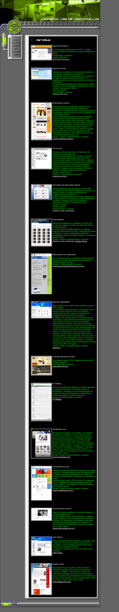
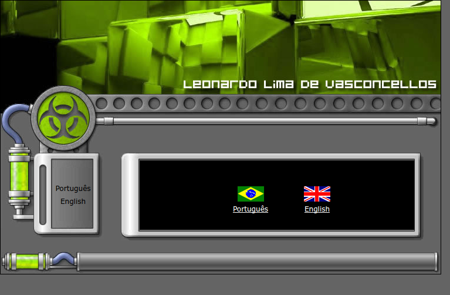
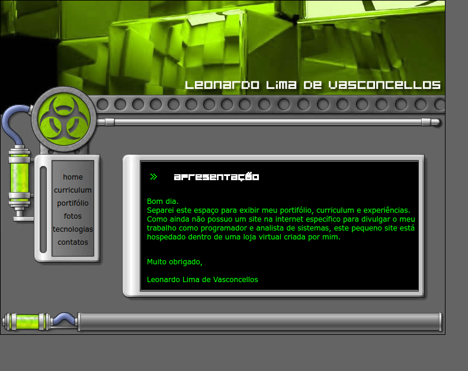
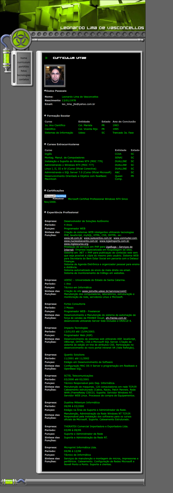
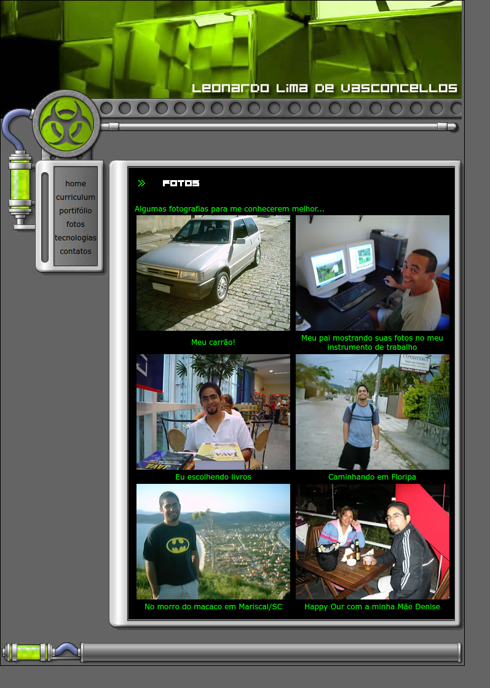
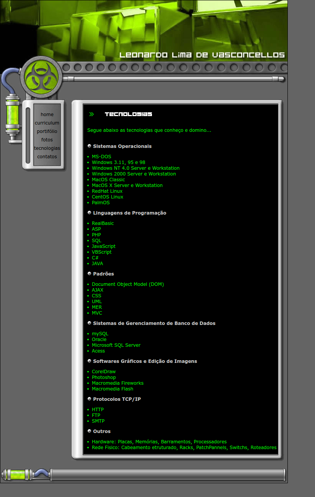
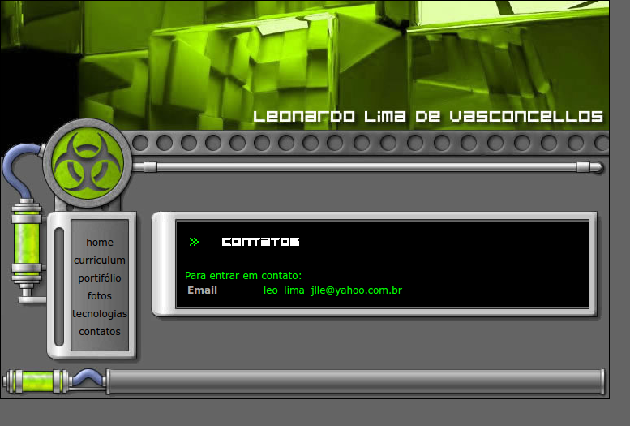

<!-- BACK TO TOP ANCHOR -->

<!-- LOGO -->

  

  <h1 align="center">Leonardo Vasconcellos — First Website</h1>

  
My history on the web!

  
// personal website · portfolio · 2007

   

  <a href="https://leonardo-vasconcellos.vercel.app/portfolio/first-personal-website"
    ><strong>View it live »</strong></a>

 

<!-- SHIELDS -->

[![Creator Website][website-shield]][website-url]
[![Contributors][contributors-shield]][contributors-url]
[![Forks][forks-shield]][forks-url]
[![Issues][issues-shield]][issues-url]
[![LinkedIn][linkedin-shield]][linkedin-url]
[![Released][year-shield]][year-url]

<!-- TABLE OF CONTENTS -->

  
Table of Contents

  <ol>
    <li><a href="#about-the-project">About The Project</a></li>
    <li><a href="#screenshots">Screenshots</a></li>
    <li><a href="#built-with">Built With</a></li>
    <li><a href="#roadmap">Roadmap</a></li>
    <li><a href="#contributors">Contributors</a></li>
    <li><a href="#contact">Contact</a></li>
  </ol>

<!-- ABOUT THE PROJECT -->
## About The Project

[![Product Screenshot][product-screenshot]](https://leonardo-vasconcellos.vercel.app/portfolio/first-personal-website)

<!-- PROJECT INTRO: 260 chars max -->

A bilingual hand-coded personal website from 2007, cataloguing 13+ client-built PHP/MySQL platforms — a calling card assembled before full-stack was a job title and before GitHub was a portfolio.

<!-- END INTRO -->

- Delivered full bilingual browsing experience (EN/PT-BR) before internationalization libraries existed
- Built and shipped 13+ client PHP/MySQL sites listed in the portfolio
- Hand-coded layout with table-based CSS — no frameworks, no tools, just craft

---

This was Leonardo's first footprint on the web — a bilingual personal website hand-built in 2007, before GitHub existed as a portfolio platform and before "personal brand" entered the developer lexicon. He assembled it in raw HTML and CSS because he had already shipped enough client work to need a showcase, and because the most direct way to have a website is to build one.

**Bilingual from day one.** The site runs in both English and Portuguese via parallel directory trees (`en/` and `br/`), each with mirrored page structures and a shared design system. No i18n libraries, no build steps — just clean structural separation that let Brazilian and international clients navigate in their own language. The bilingual requirement was built into the architecture from the start, not bolted on after.

**A live catalogue of client work.** The portfolio section documents every production system Leonardo had shipped by 2007: custom PHP/MySQL CMS platforms built for clients who needed to manage their own content without technical staff; an e-commerce system with full inventory management, boleto bancário payment integration, and Google-powered search; an email marketing engine (Reacher WebMailer) with audience segmentation, a WYSIWYG template editor, and CRON-scheduled batch sends that delivered personalised emails — not mass blasts — to stay out of spam filters; a government social-welfare records system (Secretaria do Bem Estar Social) replacing paper files with digital family registries, programme tracking, and HTML-based printed reports; and a web analytics tool adapted from open source and extended with Brazilian regional geographic data.

Most entries credit sole authorship: design, analysis, and implementation by Leonardo. For clients, that meant one point of contact from brief to deployment — leaner projects with no handoffs, no version mismatches, and no communication overhead between designer and developer.

**A complete professional history.** The resume section reads like a systems engineer's origin story: Windows NT network administration starting in 1996, Linux (Conectiva official courses), Oracle, SQL Server, ASP, MacOS X server configuration at Quantic Solutions, an Oracle/SSI B2B system for Franke Douat, and four years of independent web development. His MCP certification (Microsoft Certified Professional, Windows NT4) dated to 2000 — when many developers his age were still learning HTML.

**The design itself.** Black background, `#00FF00` green body text, hover states in acid yellow. It was 2007, and the aesthetic was deliberate — terminal palette, maximum contrast, no rounded corners, no gradients. The layout was table-based (the correct cross-browser approach before CSS positioning was reliable), with image-sliced headers and a Microsoft IE shadow filter for depth. A technically correct implementation of the web as it existed at the time.

(<a href="#readme-top">back to top</a>)

<!-- SCREENSHOTS -->
## Screenshots

  
  
  
  
  
  
  

(<a href="#readme-top">back to top</a>)

<!-- BUILT WITH -->
## Built With

<!-- LANGUAGES -->

**Languages**

|                                                                                                                          | Language   | Version |
| ------------------------------------------------------------------------------------------------------------------------ | ---------- | ------- |
|                     | HTML       | 5       |
|                       | CSS        | 3       |
|           | JavaScript | ES3     |

(<a href="#readme-top">back to top</a>)

<!-- ROADMAP -->
## Roadmap

This project repository is for archive purposes only. No new features or issues are being tracked.

(<a href="#readme-top">back to top</a>)

<!-- CONTRIBUTORS -->
## Contributors

(<a href="#readme-top">back to top</a>)

<!-- CONTACT -->
## Contact

[Leonardo Vasconcellos - Website](https://leonardo-vasconcellos.vercel.app/) — [LinkedIn](https://www.linkedin.com/in/llvasconcellos)

(<a href="#readme-top">back to top</a>)

<!-- MARKDOWN LINKS & IMAGES -->

[website-shield]: https://img.shields.io/badge/Creator_Website-%E2%86%97-2eba7a?style=for-the-badge
[website-url]: https://leonardo-vasconcellos.vercel.app/
[contributors-shield]: https://img.shields.io/github/contributors/llvasconcellos2/first-personal-website.svg?style=for-the-badge
[contributors-url]: https://github.com/llvasconcellos2/first-personal-website/graphs/contributors
[forks-shield]: https://img.shields.io/github/forks/llvasconcellos2/first-personal-website.svg?style=for-the-badge
[forks-url]: https://github.com/llvasconcellos2/first-personal-website/network/members
[issues-shield]: https://img.shields.io/github/issues/llvasconcellos2/first-personal-website.svg?style=for-the-badge
[issues-url]: https://github.com/llvasconcellos2/first-personal-website/issues
[linkedin-shield]: https://img.shields.io/badge/-LinkedIn-0A66C2?style=for-the-badge&logo=linkedin&logoColor=white
[linkedin-url]: https://www.linkedin.com/in/llvasconcellos
[year-shield]: https://img.shields.io/badge/Released-2007-gray?style=for-the-badge
[year-url]: #
[product-screenshot]: screenshots/language-selection.png
